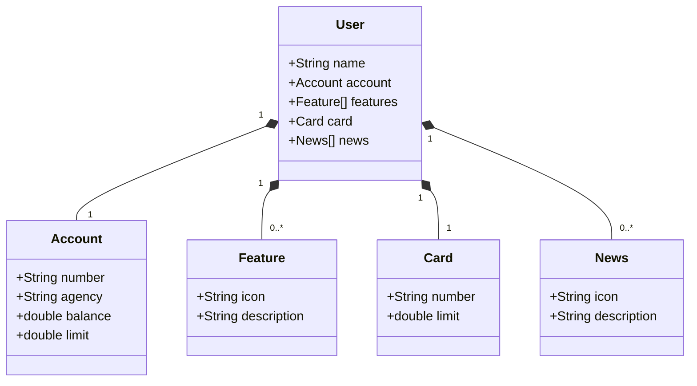

# GFT- DEV BOOTCAMP
Java RESTful API criada de replicada para entrega de projeto final no GFT BOOTCAMP JAVA COM IA
RESTful Java API created and replicated for final project delivery in GFT BOOTCAMP JAVA WITH AI

## Diagrama de classes (Class Diagram)

